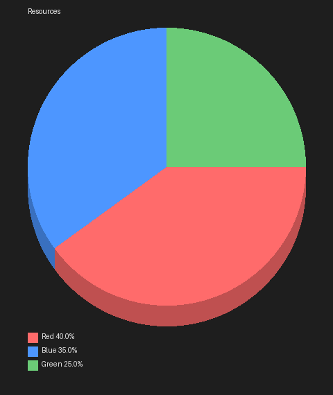

# piecraft ✨

A Python library that **creates Minecraft-style pie charts.**

---

### 🚀 Quick Start (빠르게 시작하기)

Created by an 11-year-old developer! I love Minecraft and Python. I designed the logic, and GPT helped me with the complex coding parts. I learned a lot during this process and finally published it on PyPI!

**Install `piecraft`:**

```bash
pip install piecraft
```

---

### 🎨 Usage Example (사용 예시)

Here's how you can use `piecraft` to create your own Minecraft-style chart:

```python
from piecraft import Pie

# Create a new chart object
pie = Pie(200, title="Resources")

# Add data: (value, color_hex, label)
pie.add(40, "#FF6B6B", "Red")
pie.add(35, "#4D96FF", "Blue")
pie.add(25, "#6BCB77", "Green")

# Save the chart as an image
pie.save("chart.png")
```



---

### 💡 Features (주요 기능)

* **Minecraft-themed visuals:** Generate pie charts with colors and styles inspired by Minecraft.
* **Simple API:** Easy to add data and save images with just a few lines of code.
* **Data Visualization:** Perfect for showing your game statistics, inventory, or resource distribution!

---

### 🛠️ How to Contribute (기여 방법)

I'm still learning, but I welcome any ideas or contributions!
* If you find a bug, please open an issue.
* If you have a feature request, let me know!

---

### 🙏 Thanks (감사 인사)

Thanks to GPT for helping me with the code. 
If you like this project, please give it a star!

